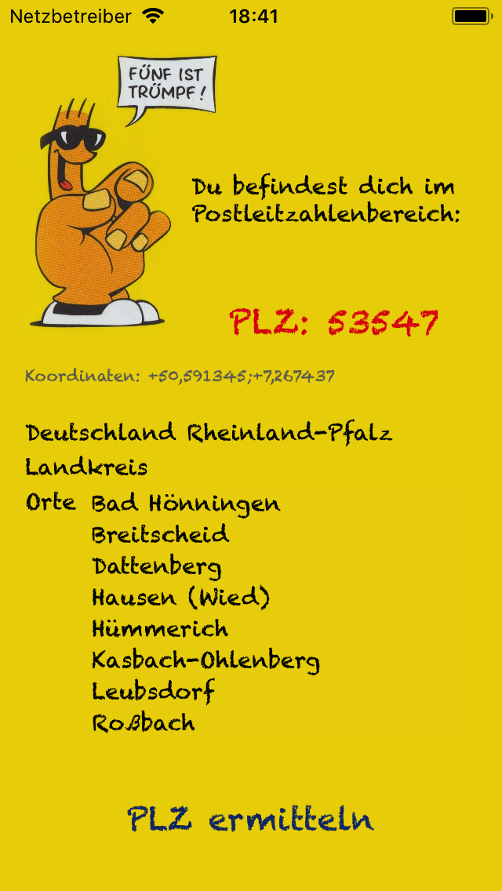

# RolfOffl

RolfOffl is a GIS-Experiment. It finds german ZIP codes on a german GPS position, offline. When the Device is outside of Germany, it knows it is not in Germany. Funny, hehe.

The App is a little proof of concept using spatialite (a sqlite3 database with geospatial extension) on iOS devices. 
The app fetches the GPS coordinates from the device and fires a geospatial query against the local GIS database. 
The result on a position consist of ZIP code, country (currently always germany), state (aka Bundesland), county (e.g. Landkreis) and city (Ort).

## Attention
Although spatialite is developed and maintained by Alessandro Furieri and are licensed under the MPL tri-license terms it uses the GEOS (Geometry Engine Open Source) library which is licensed under LGPL 2.1. Ok, that means: If you want using the RolfOffl sources e.g. with a replacement or modifications to GEOS - feel free to fork the project and do what you want!

## License information
Licensed under the LGPL 2.1

## Techonologie stack
The App is written in Swift 4 with a wrapper written in C and Objective-C 2.0 to access spatialite/sqlite3 libraries.

## Pictures

## Todo
Settings section with Copyrights and License notes. Less funny.
